# Nyxia

<p align="center">
    
</p>

<p align="center"><strong>Astrophotography planning for better nights under the stars.</strong></p>

Nyxia is a Flutter app that helps photographers and stargazers plan observation sessions with weather insights, celestial tracking, practical calculators, and event management in one place.

## Table of Contents

- [Features](#features)
- [Tech Stack](#tech-stack)
- [Getting Started](#getting-started)
- [Environment Variables](#environment-variables)
- [Project Structure](#project-structure)
- [Screenshots](#screenshots)
- [Testing](#testing)
- [License](#license)

## Features

- Firebase and Google sign-in authentication flow
- Session planning with calendar-based personal event management
- Track tab for moon phase and aurora conditions
- APOD gallery with day-by-day browsing
- Utility tools including NPF and depth-of-field calculators
- Location-aware experience for observation readiness

## Tech Stack

- Flutter + Dart
- Provider (state management)
- Firebase Core, Firebase Auth, Cloud Firestore
- Google Sign-In
- Geolocator
- Shared Preferences
- HTTP-based API integrations

## Getting Started

### Prerequisites

- Flutter SDK (stable channel)
- Dart SDK compatible with the installed Flutter version
- Android Studio and/or Xcode (for emulator/device targets)
- Firebase project configuration files for target platforms

### Install Dependencies

```bash
flutter pub get
```

### Configure Environment

Copy `.env.example` to `.env` and set your API keys:

```env
OPENWEATHER_API_KEY=your_openweather_api_key
NASA_API_KEY=your_nasa_api_key
```

### Run the App

```bash
flutter run
```

## Environment Variables

Nyxia expects these variables in `.env`:

- `OPENWEATHER_API_KEY`
- `NASA_API_KEY`

## Project Structure

```text
lib/
    core/
        constants/
    data/
        models/
        repositories/
        services/
    domain/
        usercases/
    presentation/
        routes/
        viewmodels/
        views/
        widgets/
```

## Screenshots

<p>
    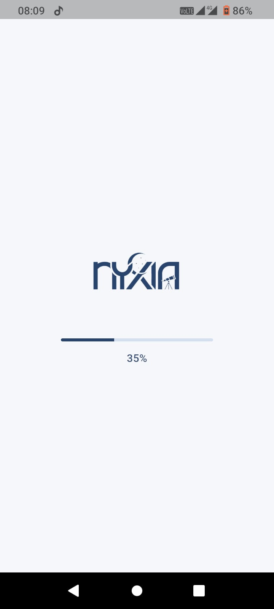
    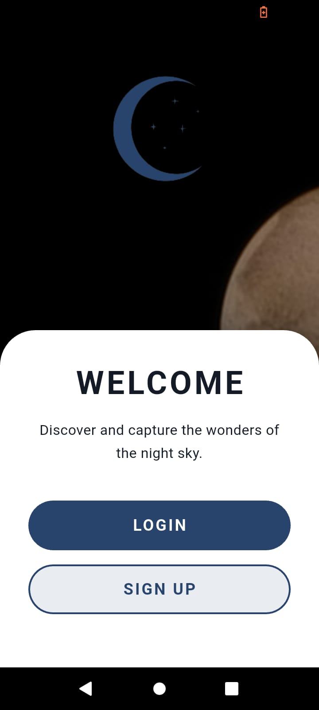
    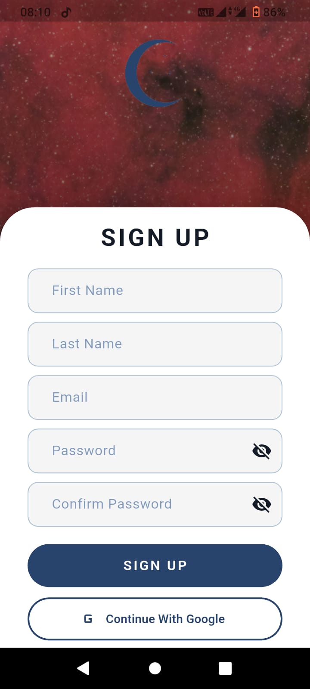
</p>

<p>
    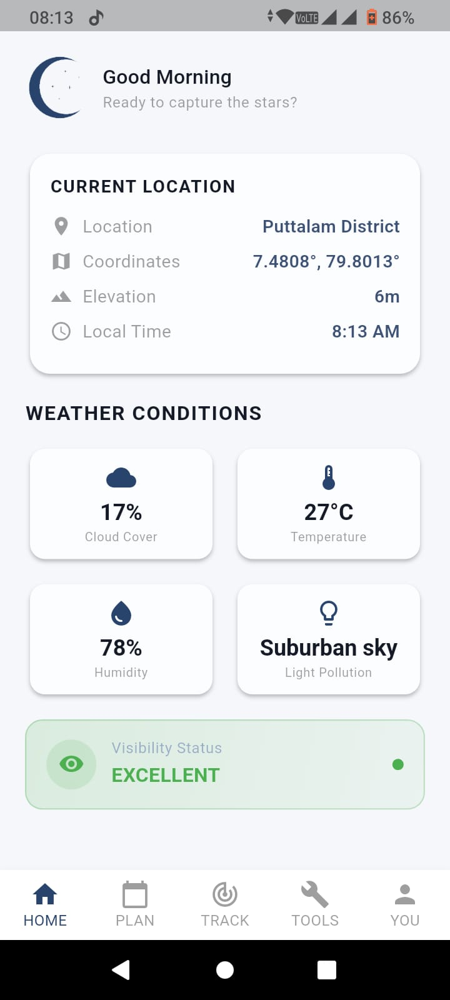
    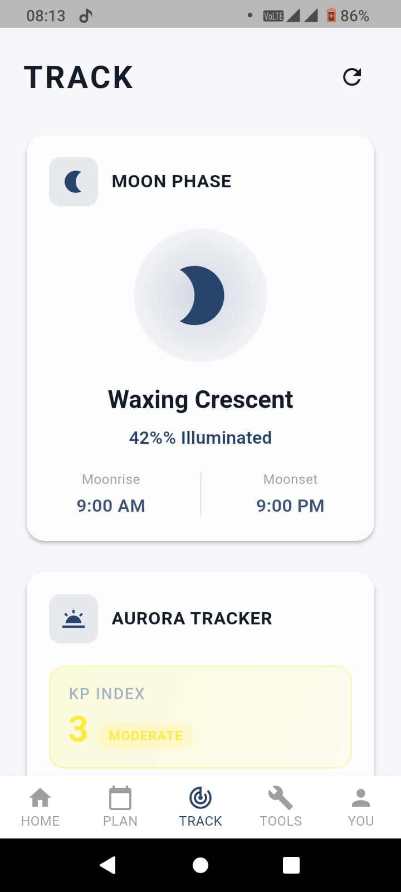
    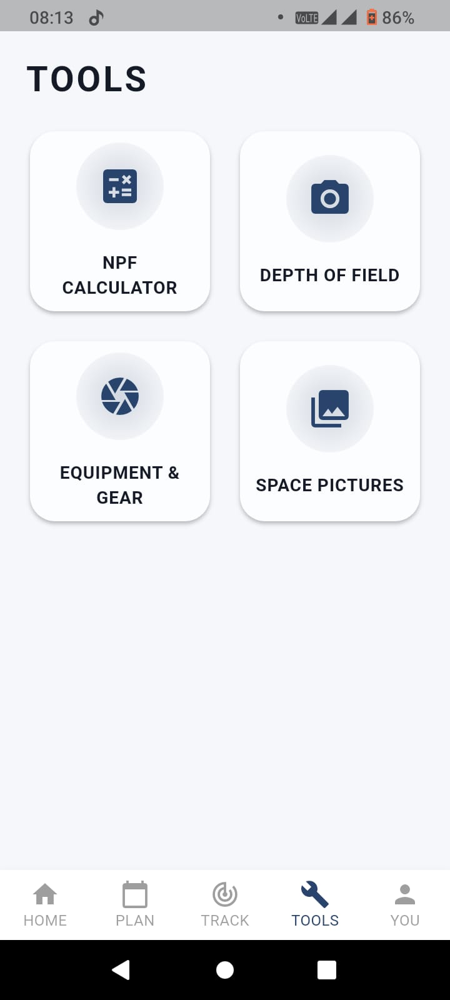
</p>

<p>
    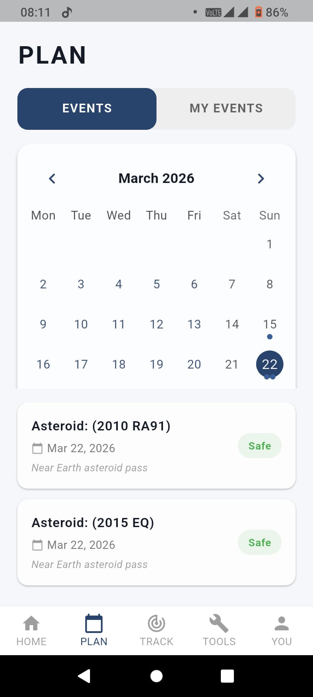
    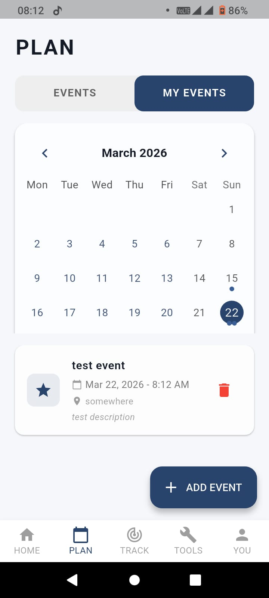
    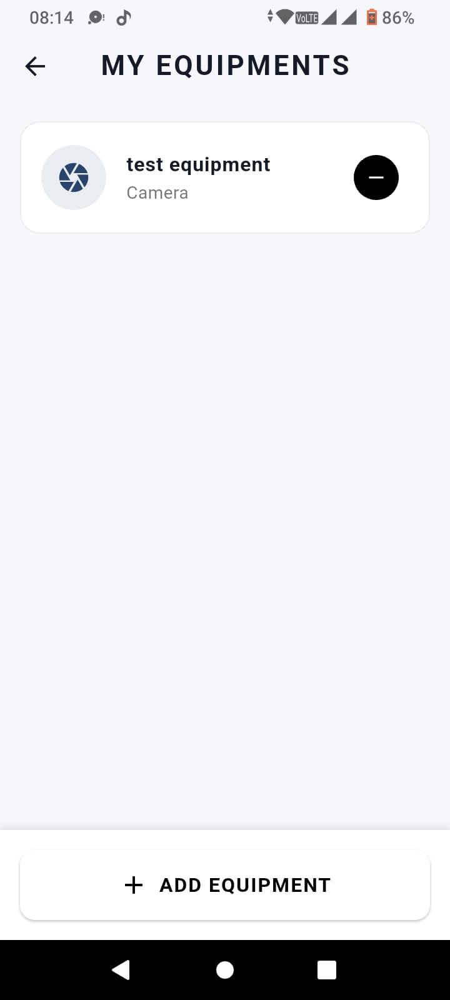
</p>

<p>
    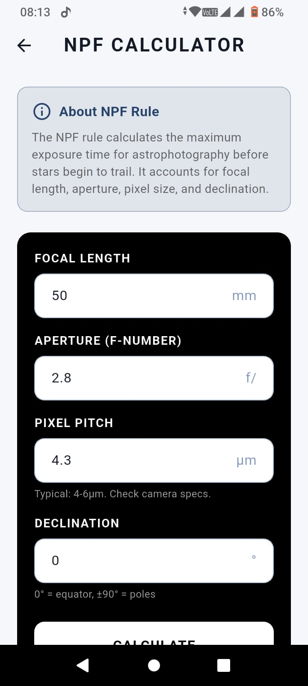
    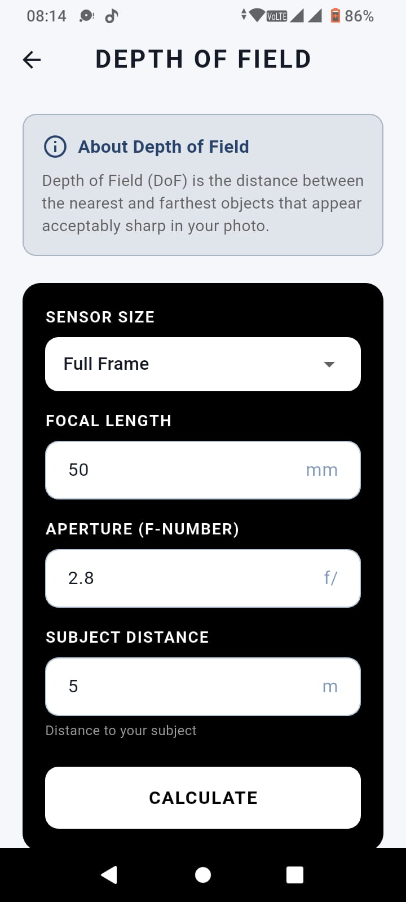
    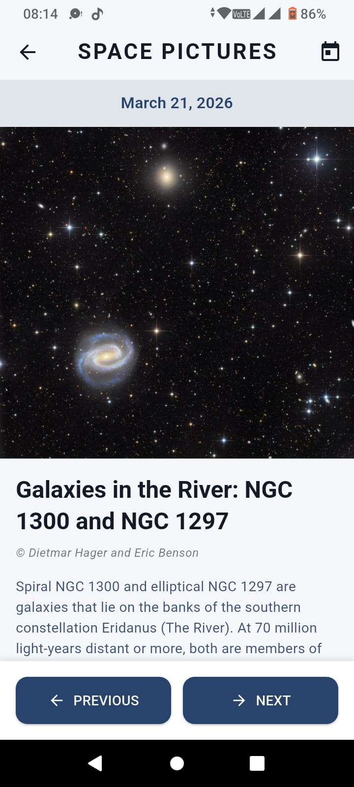
</p>

<p>
    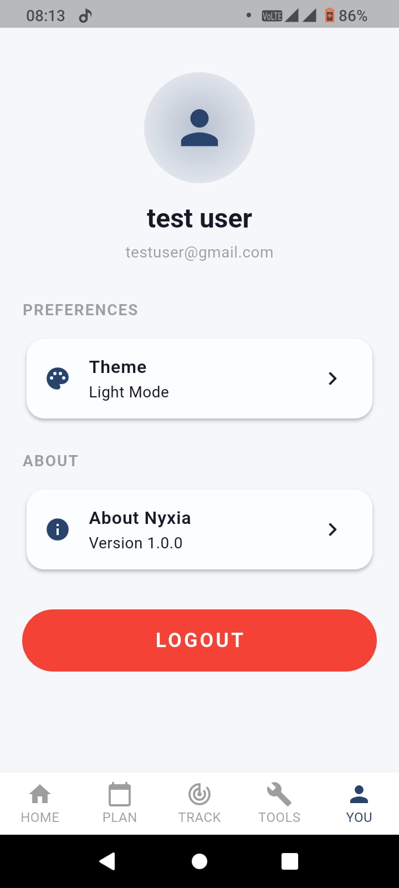
</p>

## Testing

Run all tests:

```bash
flutter test
```

Generate coverage:

```bash
flutter test --coverage
```

## License

This repository is licensed under the terms in the LICENSE file.