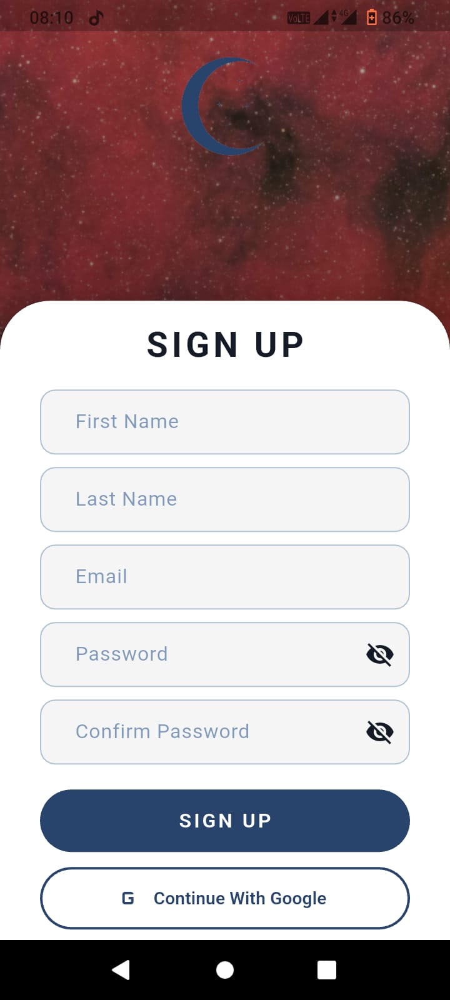
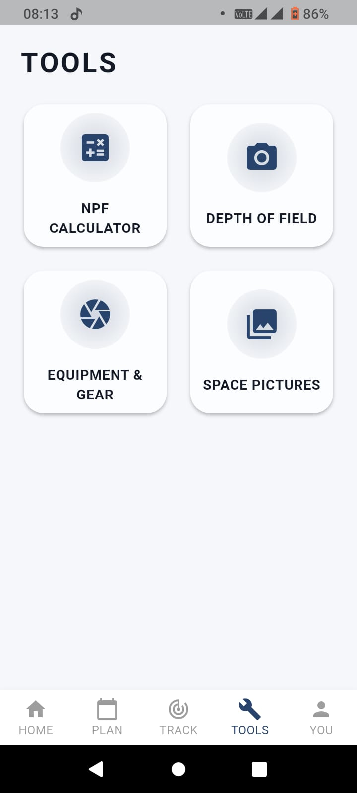
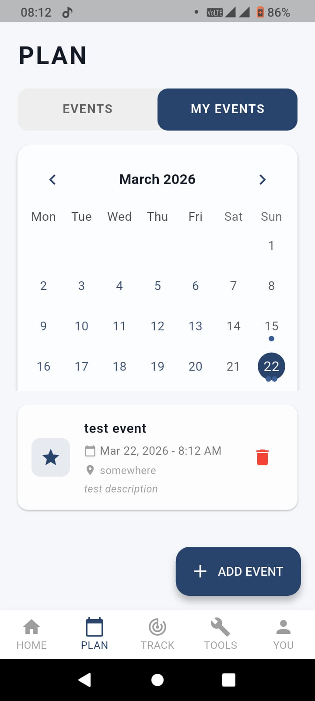
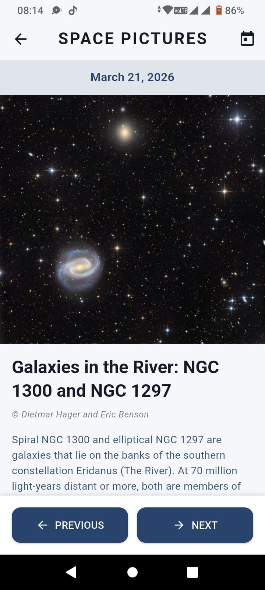

# Nyxia

Nyxia is a Flutter-based astrophotography planner focused on helping users plan observation sessions, track sky conditions, and manage photography workflows in one app.

## Overview

The app combines weather and location context, astronomy event planning, moon and aurora tracking, APOD-based image discovery, and equipment/event management.

Core experience includes:

- Authentication with Firebase and Google sign-in
- Home dashboard with location and observation-relevant data
- Planning tab with calendar-based event management
- Tracking tab for moon and aurora conditions
- Tools including NPF and depth-of-field calculators
- APOD gallery browsing with day navigation

## Tech Stack

- Flutter (Dart)
- Provider for state management
- Firebase Core/Auth/Firestore
- Google Sign-In
- HTTP-based API integrations
- Geolocator
- Table Calendar
- Shared Preferences

## Environment Variables

Create a `.env` file in the project root (or copy from `.env.example`) and provide:

```env
OPENWEATHER_API_KEY=your_openweather_api_key
NASA_API_KEY=your_nasa_api_key
```

## Getting Started

### 1. Prerequisites

- Flutter SDK (stable)
- Dart SDK (as required by the Flutter version)
- Android Studio or Xcode (for device/emulator targets)
- Firebase project configuration for your target platforms

### 2. Install dependencies

```bash
flutter pub get
```

### 3. Configure environment

```bash
cp .env.example .env
```

Then update values in `.env`.

### 4. Run the app

```bash
flutter run
```

## Testing

Run tests:

```bash
flutter test
```

Generate coverage:

```bash
flutter test --coverage
```

## Project Structure

```text
lib/
    core/
        constants/
    data/
        models/
        repositories/
        services/
    domain/
        usercases/
    presentation/
        routes/
        viewmodels/
        views/
            screens/
            themes/
            widgets/
```

## Screenshots

### Main Screens

| Screen | Preview |
| --- | --- |
| Loading |  |
| Home |  |
| Sign Up |  |
| Track |  |
| Tools |  |
| My Events |  |
| Gallery |  |

### Additional Screens

.jpeg)
.jpeg)
.jpeg)
.jpeg)
.jpeg)


## Notes

- Firebase options are configured through `lib/core/constants/firebase_options.dart`.
- API keys are loaded from `.env` at app startup.

## License

This repository is licensed under the terms in the `LICENSE` file.